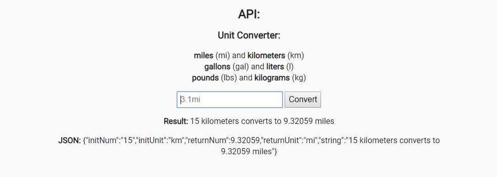

# Metric - Imperial Converter

## Introduction
A unit converter for metric and imperial values.  

Testing is done with Chai.

This project is part of freeCodeCamps Information Security and Quality Assurance certificate.

***

## Project Requirements
* The client is prevented from trying to guess (sniff) the MIME type.
* Cross-site scripting (XSS) attacks are prevented.
* It is possible to GET /api/convert with a single parameter containing an accepted number and unit and have it converted.
Hint: Split the input by looking for the index of the first character.
* It is possible to convert 'gal' to 'L' and vice versa. (1 gal to 3.78541 L)
* It is possible to convert 'lbs' to 'kg' and vice versa. (1 lbs to 0.453592 kg)
* It is possible to convert 'mi' to 'km' and vice versa. (1 mi to 1.60934 km)
* If the unit of measurement is invalid, returned will be 'invalid unit'.
* If the number is invalid, returned will be 'invalid number'.
* If both are invalid, returned will be 'invalid number and unit'.
* It is possible to use fractions, decimals or both in my parameter (ie. 5, 1/2, 2.5/6), but if nothing is provided it will default to 1.
* The return will consist of the initNum, initUnit, returnNum, returnUnit, and string spelling out units in format {initNum} {initial_Units} converts to {returnNum} {return_Units} with the result rounded to 5 decimals.
* All 16 unit tests are complete and passing.
* All 5 functional tests are complete and passing.

***

## Final Project
https://fcc-infosec-metric-imperial-converter-fred.glitch.me

***

## Behind the scenes
### Backend:
* Node
* Express
* Mongodb
* Helmet
* Chai

### Database:
* MongoDB

### Hosting:
* Glitch
* mLab

***

## Preview Images
### Main Screen:

